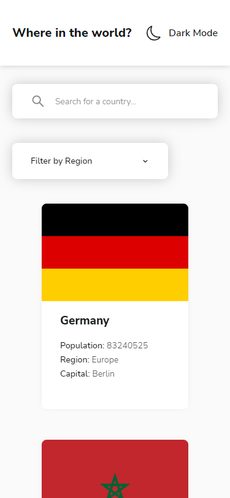
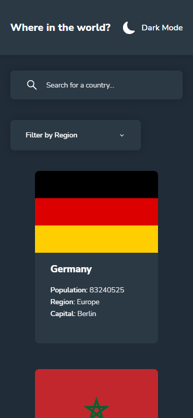
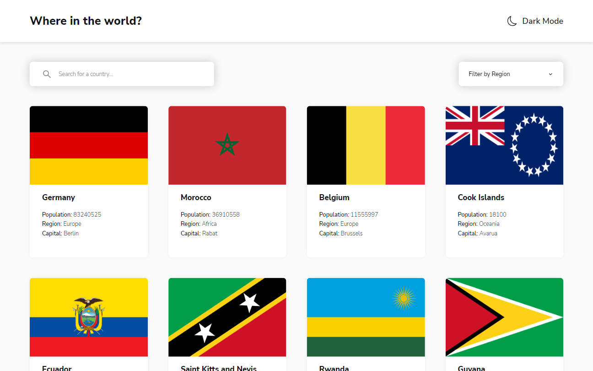
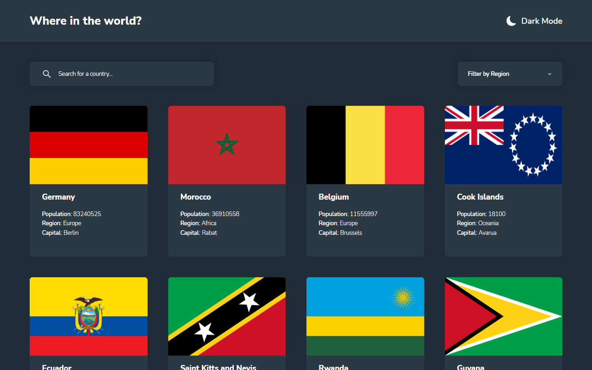
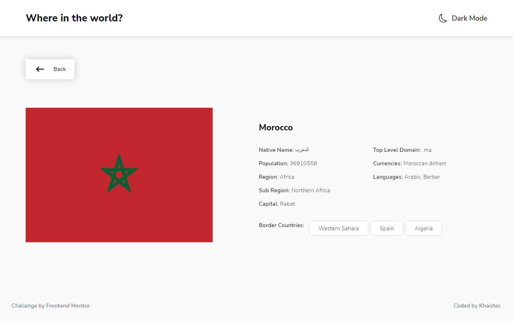
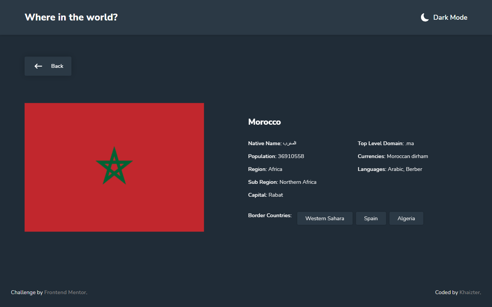

# Frontend Mentor - REST Countries API with color theme switcher solution

This is a solution to the [REST Countries API with color theme switcher challenge on Frontend Mentor](https://www.frontendmentor.io/challenges/rest-countries-api-with-color-theme-switcher-5cacc469fec04111f7b848ca). Frontend Mentor challenges help you improve your coding skills by building realistic projects.

## Table of contents

- [Overview](#overview)
  - [The challenge](#the-challenge)
  - [Screenshot](#screenshot)
  - [Links](#links)
- [My process](#my-process)
  - [Built with](#built-with)
  - [What I learned](#what-i-learned)
  - [Continued development](#continued-development)
- [Author](#author)

## Overview

### The challenge

Users should be able to:

- See all countries from the API on the homepage
- Search for a country using an `input` field
- Filter countries by region
- Click on a country to see more detailed information on a separate page
- Click through to the border countries on the detail page
- Toggle the color scheme between light and dark mode _(optional)_

### Screenshot

#### Main Page

#### Detail Page

### Links

- Solution URL: [Github](https://github.com/khaizter/country-theme-switch)
- Live Site URL: [Netlify](https://khaizter-where-in-the-world.netlify.app)

## My process

### Built with

- Semantic HTML5 markup
- Flexbox/Grid
- Mobile-first workflow
- [React](https://reactjs.org/) - Front End Framework
- [REST Countries API](https://restcountries.com/) - Data API
- [Styled Components](https://styled-components.com/) - CSS Preprocessor
- [Framer Motion](https://www.framer.com/motion/) - Animation Library

### What I learned

I learned a lot during this project specially with the APIs sending an http request, handling error and loading data. i also learn some things about SVGs like animations and more possibilities.

### Continued development

Maybe i will tackle about state management, authentication in my next project. I was thinking of looking into Redux and Firebase.

## Author

- Frontend Mentor - [@khaizter](https://www.frontendmentor.io/profile/khaizter)
- Github - [@khaizter](https://github.com/khaizter)
